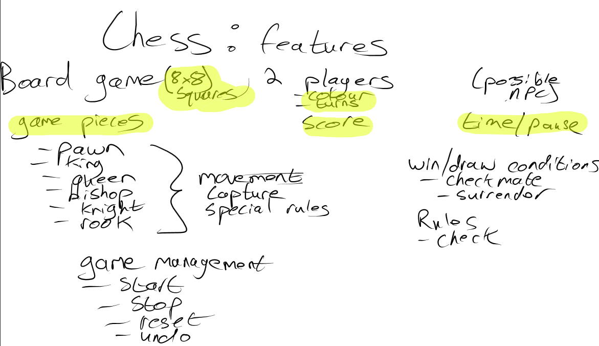

# IAD-25-Chess
TEAM: All+Alex

# Chess team Feature.

Check and check mate.

- Check occurs when a player's king is under direct attack
- Check mate happends when the king is in check and there is no legal way to remove it from that attack, resulting in the immediate end of the game and a win for the opponent.

# Steps

 
